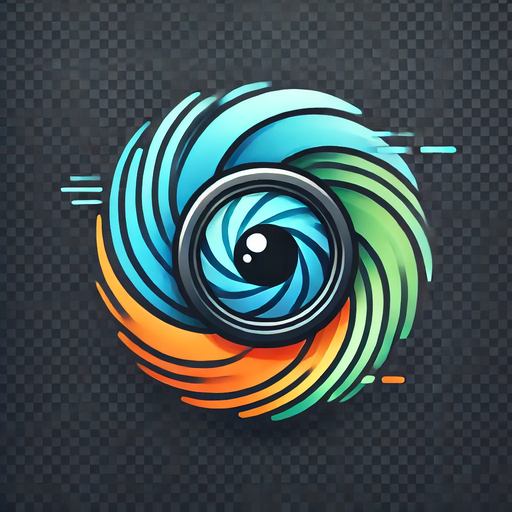
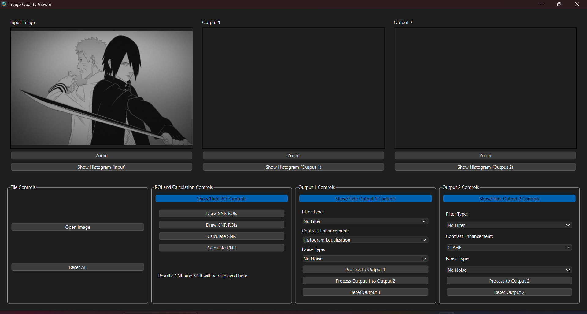
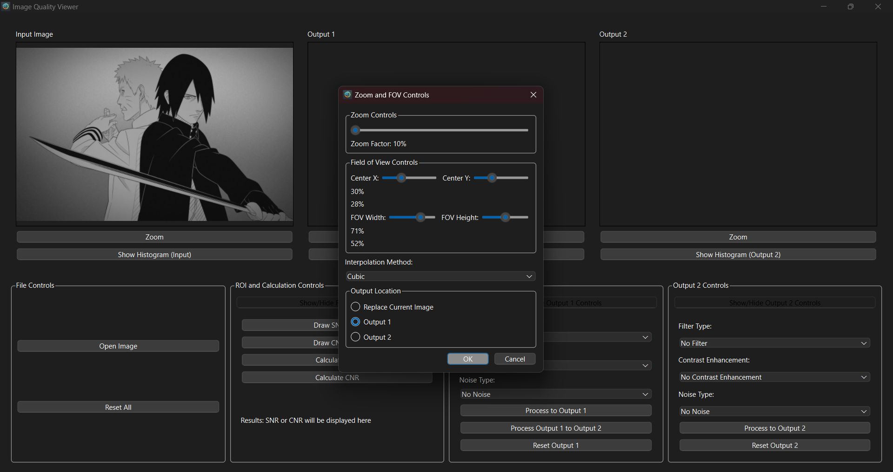
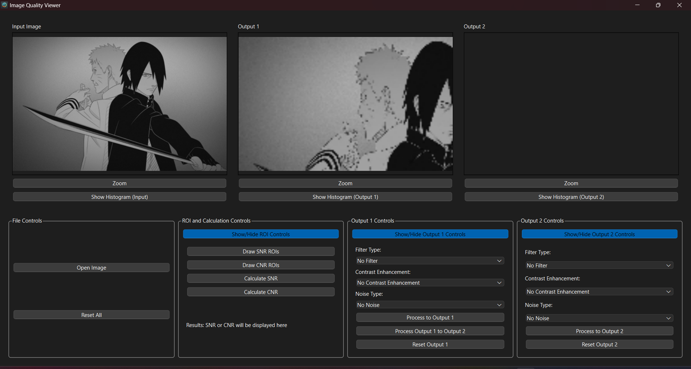
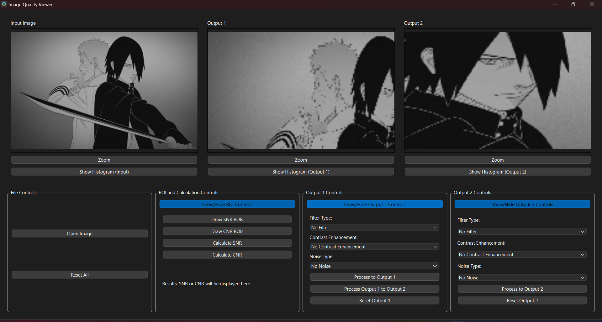
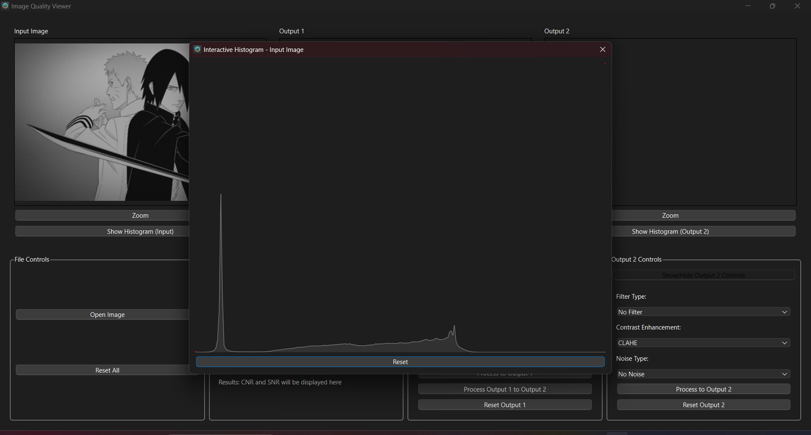
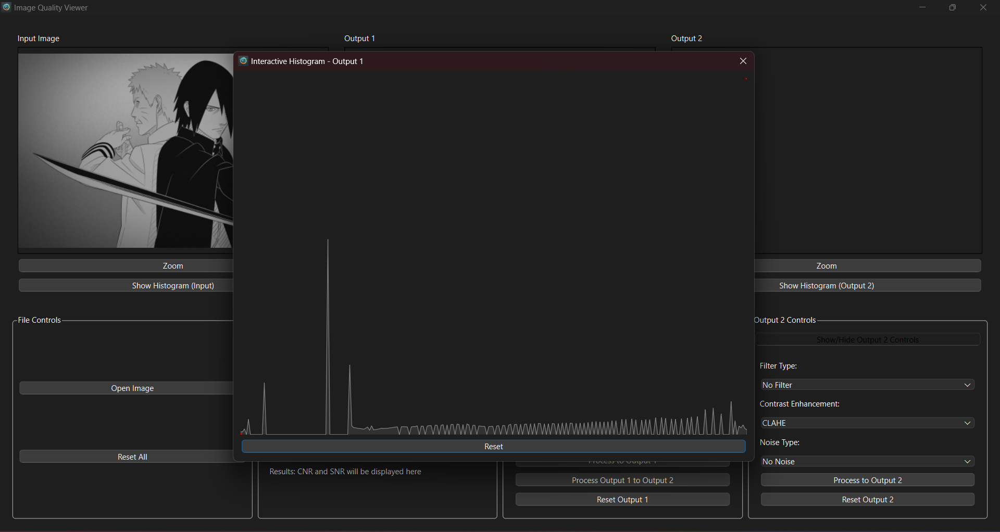
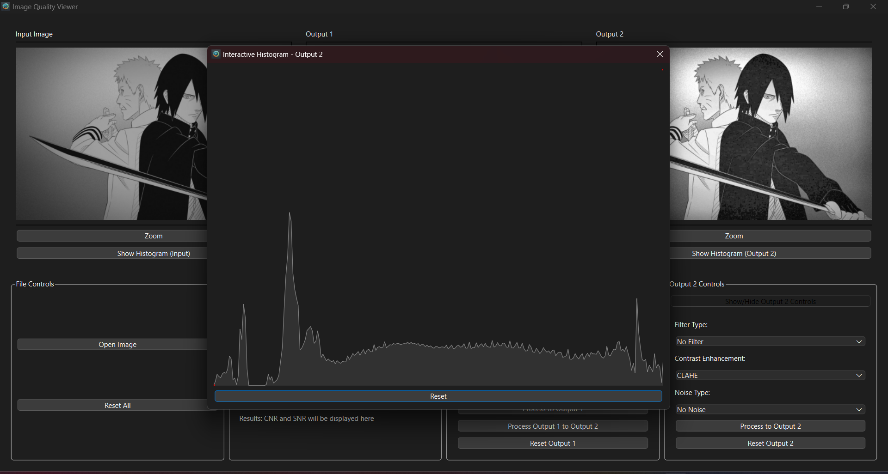
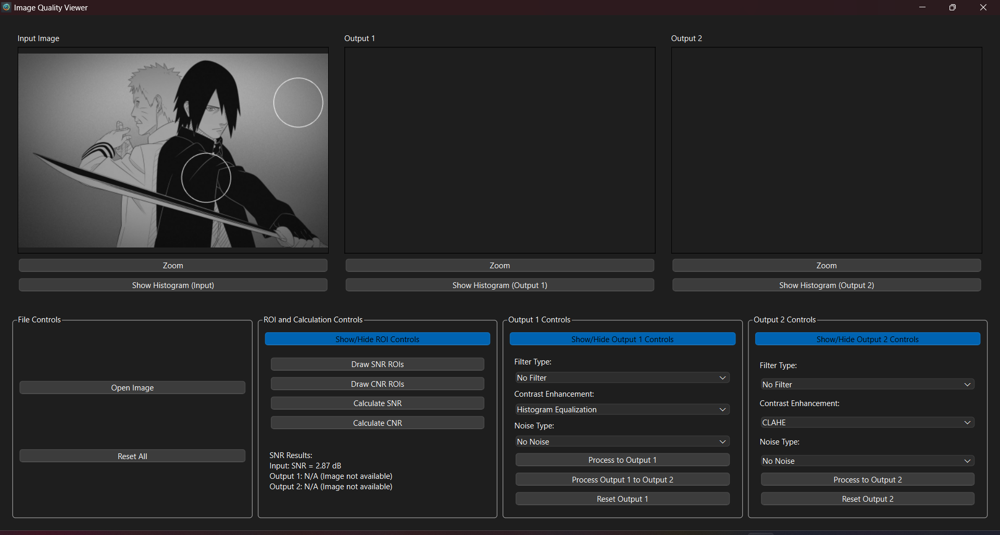
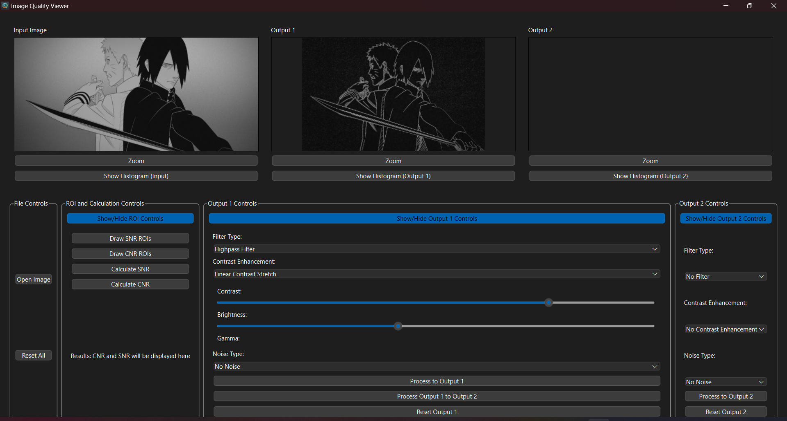

# 🖼️ **Image Viewer & Manipulator** 🎛️  

  

_A cutting-edge GUI application for interactive image viewing, processing, and analysis._  

---  

## 🌟 **Overview**  

The **Image Viewer & Manipulator** is an intuitive and powerful tool for managing and analyzing images. With a user-friendly interface 🎨 and a suite of advanced features, this application is perfect for professionals and enthusiasts alike. From applying filters to calculating critical image metrics, this tool ensures precision and ease of use.  

---  

## 🔑 **Key Features**  

### 🖥️ **Interactive Image Viewer**  
- Supports both color 🌈 and grayscale images.  
- 🔍 Zoom and pan functionality with adjustable field of view (FOV).  
- 📊 Dynamic histogram for real-time image fine-tuning.  

### 🛠️ **Advanced Image Processing**  
- Comprehensive filters, including:  
  - 🌫️ Gaussian Blur  
  - 🧹 Median Filter  
  - 🔎 Unsharp Masking  
  - 🛑 Sobel Filter  
- ✨ Contrast enhancement options:  
  - Linear Contrast Stretch  
  - Gamma Correction  
  - CLAHE (Contrast Limited Adaptive Histogram Equalization)  

### 🎲 **Noise Augmentation**  
- Add various noise types for simulation and testing:  
  - Gaussian Noise  
  - Salt & Pepper Noise  

### 📐 **ROI-Based Analysis**  
- Define regions of interest (ROIs) for advanced metrics:  
  - 📈 **SNR (Signal-to-Noise Ratio)**  
  - 🔍 **CNR (Contrast-to-Noise Ratio)**  

### 🔄 **Chain Processing**  
- Seamlessly apply multiple transformations in a single workflow.  

---  

## 📸 **Screenshots**  

### 🖼️ **Main Interface**  
  

### 🔍 **Zoom and FOV Controls**  
  
*Zoom and FOV Controls*  

  
*Zoom with Bicubic Interpolation*  

  
*Zoom with Nearest Neighbor Interpolation*  

### 📊 **Interactive Histogram**  
  
*Original Histogram*  

  
*Histogram Equalization*  

  
*CLAHE (Adaptive Histogram Equalization)*  

### 📈 **SNR and CNR Analysis**  
  
*Signal-to-Noise Ratio Calculation*  

  
*CNR Before and After Noise Reduction*  

### 🎛️ **Filter and Contrast Adjustments**  
  
  
  

---  

## ⚙️ **Installation**  

### **Step 1: Clone the Repository**  
```bash  
git clone https://github.com/your-repo/image-viewer-manipulator.git  
cd image-viewer-manipulator  
```  

### **Step 2: Set Up a Virtual Environment (Optional but Recommended)**  
```bash  
python -m venv venv  
source venv/bin/activate    # On Windows: venv\Scripts\activate  
```  

### **Step 3: Install Dependencies**  
```bash  
pip install -r requirements.txt  
```  

### **Step 4: Run the Application**  
```bash  
python Image_Viewer_Maniplutor.py  
```  

---  

## 🛠️ **Requirements**  

The following libraries are required for this application:  
```plaintext  
PyQt6==6.5.2  
opencv-python-headless==4.5.4.60  
numpy==1.23.5  
matplotlib==3.7.3  
```  

Ensure that `OpenCV` and `PyQt6` are installed properly to avoid runtime errors.  

---  

## 🤝 **Contributing**  

Contributions are welcome! 🚀 To contribute:  

1. Fork the repository.  
2. Create a new branch for your feature or bugfix.  
3. Submit a pull request with a detailed description of your changes.  

For major changes, open an issue to discuss your ideas.  

---  

## 📜 **License**  

This project is licensed under the **MIT License**. Refer to the `LICENSE` file for more details.  

---  

## 🙌 **Meet the Team**  

This project was developed by a passionate and talented team:  

- [**Sief Eldin Sameh**](https://github.com/SiefEldinSameh)  
- [**Fahd Ahmed**](https://github.com/fahdahmed10)  
- [**Ahmed Salem**](https://github.com/Ahmedo0oSalem)  
- [**Karim Farid**](https://github.com/eslamFared)  

Thank you for using the **Image Viewer & Manipulator**! 🎉  
